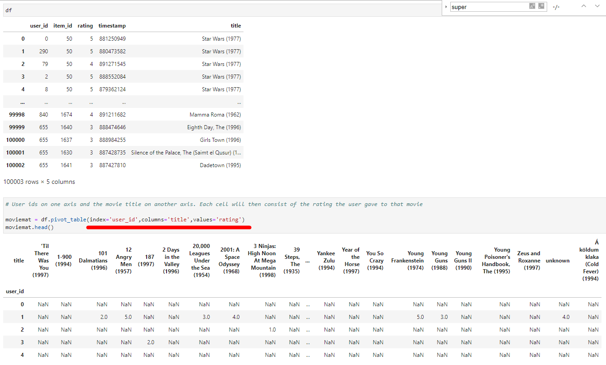

# Recommender-Systems

It provides a basic recommendation system by suggesting items that are most similar to a particular item, in this case, movies. Keep in mind, this is not a true robust recommendation system, to describe it more accurately,it just tells you what movies/items are most similar to your movie choice.

EDA:

Create a ratings dataframe with average rating and number of ratings.

Create a matrix that has the user ids on one axis and the movie title on another axis. Each cell will then consist of the rating the user gave to that movie. Note there will be a lot of NaN values, because most people have not seen most of the movies.

Grab the user ratings for those two movies. 

Use corrwith() method to get correlations between two pandas series: Users' rating to all movies VS users' rating to starwars. To see correlation between the two.

Now if we sort the dataframe by correlation, we should get the most similar movies, however note that we get some results that don't really make sense. This is because there are a lot of movies only watched once by users who also watched star wars (it was the most popular movie).

Filter out movies that have less than 100 reviews.

corr_starwars = corr_starwars.join(ratings['num of ratings'])

corr_starwars[corr_starwars['num of ratings']>100]

corr_starwars[corr_starwars['num of ratings']>100].sort_values('Correlation',ascending=False).head()
